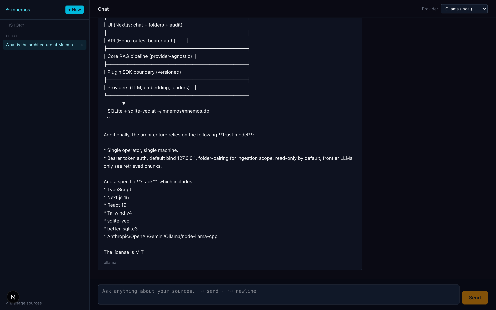
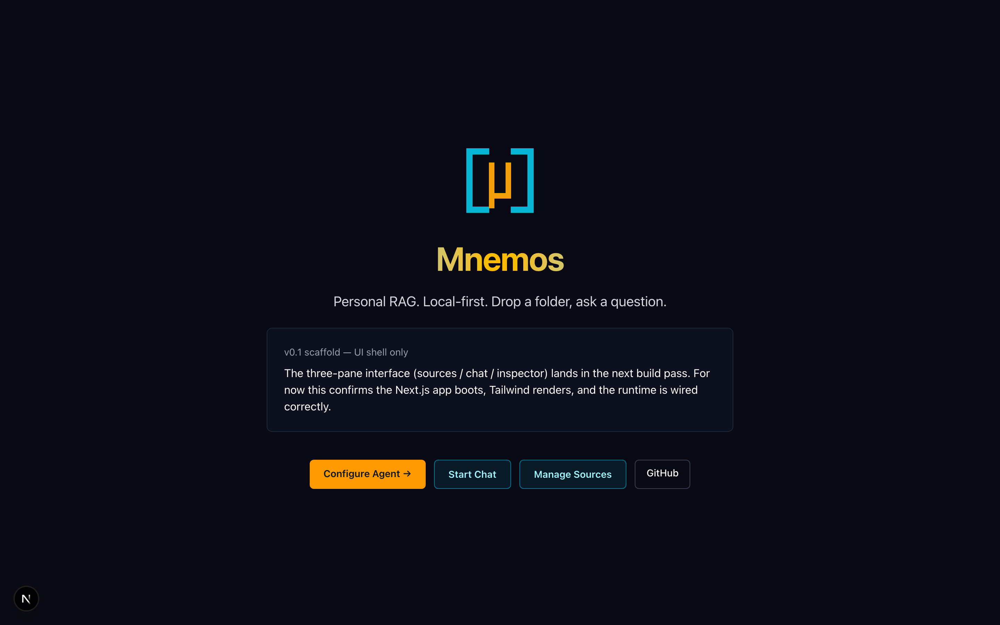
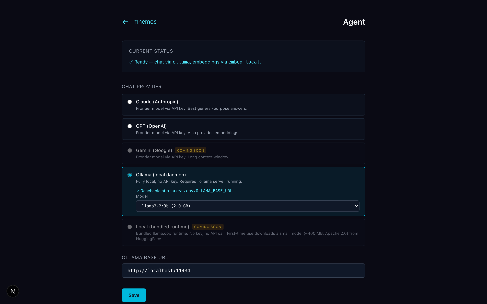
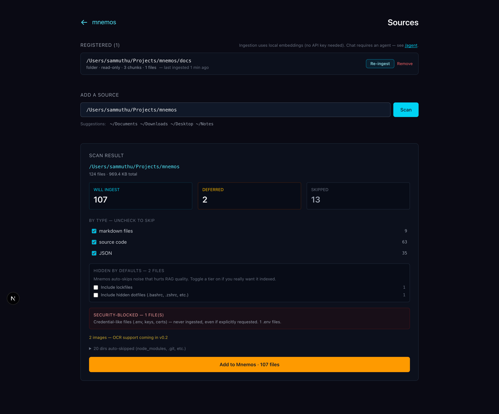

<div align="center">

# 🧠 Mnemos

**Personal RAG. Local-first. Drop a folder, ask a question.**

[](LICENSE)
[](https://nodejs.org/)
[](CHANGELOG.md)
[](CONTRIBUTING.md)

</div>

Mnemos is a personal RAG (retrieval-augmented generation) system that runs entirely on your own machine. Drop a folder of documents, ask questions in plain English, get answers with file citations. Your files never leave your computer; only the retrieved chunks are sent to whichever LLM you choose, and the audit log shows exactly what was sent.

Built from scratch in TypeScript + Next.js. Opinionated single-pane UI — no drag-and-drop canvas, one strong default per pipeline stage, plug your own providers via a versioned SDK.

<p align="center">
  
  <br/>
  <em>Asking "when did I apply" against an ingested job-applications folder — answer is grounded in the retrieved chunks with inline citations.</em>
</p>

## Quick start

The only prerequisite is **Node 22+** ([nodejs.org](https://nodejs.org/) if you don't have it).

```bash
git clone https://github.com/cosmicflow-space/mnemos.git
cd mnemos
node setup.mjs
```

That's it. The installer detects your OS (macOS, Linux, Windows), checks what's installed, asks before fixing anything, walks you through provider configuration, and starts the dev server. The install logic lives in [`INSTALL.md`](INSTALL.md) — readable as docs, executable by `setup.mjs`, no per-OS shell scripts to drift.

Then open <http://127.0.0.1:3030>:

1. **Configure an agent** — pick Claude, GPT, or Ollama (we auto-detect existing keys on disk).
2. **Add a source** — drop a folder path. Mnemos scans + classifies + ingests with local BGE-small embeddings (no API key for ingest).
3. **Chat** — ask a question, see streamed answers with inline citations to the exact source chunks.

End-to-end in under 90 seconds on a typical laptop.

Prefer Docker? `docker compose up -d`. Prefer manual? `pnpm install && pnpm dev`.

## What it looks like

<table>
  <tr>
    <td width="50%">
      
      <p align="center"><sub><strong>1. Home</strong> — three actions, no chrome. Configure an agent first; chat + sources unlock from there.</sub></p>
    </td>
    <td width="50%">
      
      <p align="center"><sub><strong>2. Configure agent</strong> — auto-detects credentials already on disk (shell env, provider auth files, gcloud ADC). Click <em>Use this</em> to import without copying tokens. Locations only — values are never returned by the scan API.</sub></p>
    </td>
  </tr>
  <tr>
    <td width="50%">
      
      <p align="center"><sub><strong>3. Add a source</strong> — scan shows what will ingest, what's deferred (images/audio for v0.2+), and what's auto-excluded. Security-blocked files (.env, *.pem, id_rsa*) are hard-locked. Logs, lockfiles, hidden dotfiles are opt-in. Large files (>10 MB) get a confirmation toggle.</sub></p>
    </td>
    <td width="50%">
      
      <p align="center"><sub><strong>4. Chat</strong> — sidebar groups sessions by date with titles derived from the first question. Each answer shows collapsed citations (top 3 + "more"), a metrics footer (provider · model · duration · tokens), and a hover-to-copy affordance.</sub></p>
    </td>
  </tr>
</table>

## What Mnemos is

- **Local-first**: SQLite + sqlite-vec, single file at `~/.mnemos/mnemos.db`. No separate vector database.
- **Free by default**: Bundled local embedding model (BGE-small via ONNX) means RAG works out of the box with zero external services and zero API costs. Bring your own Anthropic / OpenAI key for chat — or run fully local via Ollama.
- **Single user**: One person, one machine. Loopback bind by default; LAN binding requires explicit opt-in and bearer-token auth.
- **Pluggable providers** (v0.1 wired): Anthropic, OpenAI, Ollama for chat. Local BGE-small + OpenAI + Ollama for embeddings. Add your own via the plugin SDK. Gemini and bundled llama.cpp providers are stubs scheduled for v0.2.
- **Read-only**: Mnemos never modifies your files. Source access is opt-in per folder.
- **Auditable**: Every query records exactly which chunks were retrieved, what was sent to the LLM, and how many tokens it cost. Visible in the UI.
- **Safe defaults**: Auto-excludes credentials (`.env`, `*.pem`, `id_rsa*`) and noise (logs, lockfiles, minified bundles). Security excludes are hard-locked even against explicit user opt-in.
- **Citations**: Every answer references the source files, last-modified date, file type, and exact byte range.
- **Incremental**: Re-ingest skips unchanged files via content-hash comparison; partial-state ingests recover automatically via the `ingest_status` invariant.

## What Mnemos is not

- Not multi-tenant. Single user.
- Not a no-code visual builder. Opinionated pipeline.
- Not an agent platform. RAG only.
- Not a SaaS. Run it yourself.

## Status

Pre-release. v0.1 is being built. Track progress in [CHANGELOG.md](CHANGELOG.md).

## Architecture

The repo is a pnpm monorepo:

```
mnemos/
├── apps/web/              # Next.js 15 UI + API routes
├── packages/
│   ├── core/              # RAG pipeline (provider-agnostic)
│   ├── db/                # SQLite + sqlite-vec wrapper
│   ├── plugin-sdk/        # Plugin SDK barrel
│   └── cli/               # `mnemos` CLI
└── plugins/
    ├── embed-local/       # EmbeddingProvider (bundled, default — BGE-small via ONNX)
    ├── anthropic/         # ChatProvider (Claude)
    ├── openai/            # ChatProvider + EmbeddingProvider
    ├── gemini/            # ChatProvider
    ├── ollama/            # ChatProvider + EmbeddingProvider (host-local)
    ├── llama-cpp/         # ChatProvider + EmbeddingProvider (bundled local)
    ├── loader-pdf/        # DocumentLoader
    ├── loader-markdown/   # DocumentLoader
    ├── loader-plaintext/  # DocumentLoader
    ├── loader-web/        # DocumentLoader for URLs
    └── loader-code/       # DocumentLoader for source code
```

Plugins can only import from `mnemos/plugin-sdk`. They cannot reach into `packages/core/**` or other plugins' internals. The SDK is versioned and backward-compatible.

## Trust model

Mnemos uses a **single-user trust model** — one person on one machine, not a multi-tenant service:

- The API is bound to 127.0.0.1 by default and trusts loopback callers (anyone reaching the loopback interface is already on the user's own machine). Binding to LAN (`MNEMOS_BIND=lan`) switches enforcement on and requires `Authorization: Bearer <token>` on every `/api/*` request, matching the auto-generated token at `~/.mnemos/auth.key`.
- Installed plugins are part of the trusted base (documented)
- Source access requires explicit registration (`mnemos source add <path>`)
- Frontier LLMs only see retrieved chunks, never raw files
- The audit log shows exactly what was sent to any external service, on every request

## Your first 90 seconds

After `node setup.mjs` finishes and the dev server starts:

1. **Open `http://127.0.0.1:3030/agent`**. Mnemos auto-scans your machine for credentials in standard locations (`~/.zshrc`, `~/.bashrc`, `~/.anthropic/auth.json`, `~/.openai/auth.json`, `~/.config/gcloud/...`, and the Ollama daemon on `:11434`). Click **Use this** on any detected credential to import it — values stay on your machine, only locations are exchanged with the UI. Or pick a provider from the radio list and paste a key.

2. **Open `http://127.0.0.1:3030/sources`**. Type a folder path (e.g. `~/Documents/notes`) and click **Scan**. The scan summary tells you:
   - How many files will be ingested (by type — uncheck a type to skip it for this run)
   - What's auto-excluded (logs, lockfiles, hidden dotfiles — opt-in toggles to override)
   - What's security-blocked (`.env`, `*.pem`, `id_rsa*` — never indexed even with override)
   - How many files are over 10 MB (confirmation toggle, default include)

   Click **Add to Mnemos**. The streaming progress bar shows per-file embedding in real time. Ingestion runs entirely locally via BGE-small (no API key needed).

3. **Open `http://127.0.0.1:3030/chat`**. Ask anything about the folder you just ingested. Each answer streams in with citations linking to the exact source files. The metrics footer shows which provider/model answered, how long it took, and tokens used.

That's it. End-to-end on a fresh laptop: usually under 90 seconds for the install + 30 seconds for the first ingestion of a small folder.

## Roadmap

- **v0.1** (current): single-folder RAG, BYO API key, audit log, atomic ingestion, smart-default file exclusions, credential auto-detection, bearer-token auth (loopback bypass), cross-OS install via `setup.mjs`
- **v0.2**: Gemini + bundled `llama.cpp` providers, per-source persistent filters, response-quality cross-encoder reranking, npm global install
- **v0.3**: macOS/Linux native installers, plugin marketplace, email ingestion (Gmail OAuth), Telegram bot

## Contributing

See [CONTRIBUTING.md](CONTRIBUTING.md). First-time contributors will be asked to sign the [CLA](CLA.md) via the cla-assistant.io bot on their first PR — one click, then you're covered for all future PRs. AI-assisted contributions welcome; see [AGENTS.md](AGENTS.md) for collaboration patterns.

## Code of Conduct

All project-related interaction follows our [Code of Conduct](CODE_OF_CONDUCT.md).

## Security

Report vulnerabilities privately via [GitHub Security Advisory](https://github.com/cosmicflow-space/mnemos/security/advisories/new). See [SECURITY.md](SECURITY.md).

## License

MIT — see [LICENSE](LICENSE). Copyright © Zen Algorithms LLC

The CLA on contributions preserves the option to release additional terms (e.g. an Enterprise edition) in the future without re-permissioning prior contributors. The MIT-licensed code stays MIT-licensed.

## Credits

Mnemos is original work, written from scratch in TypeScript. Architectural choices were informed by surveying the broader RAG and personal-knowledge-base ecosystem.
