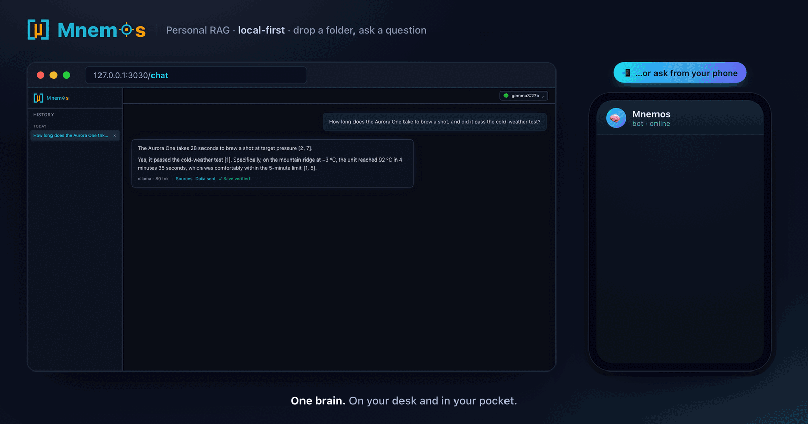
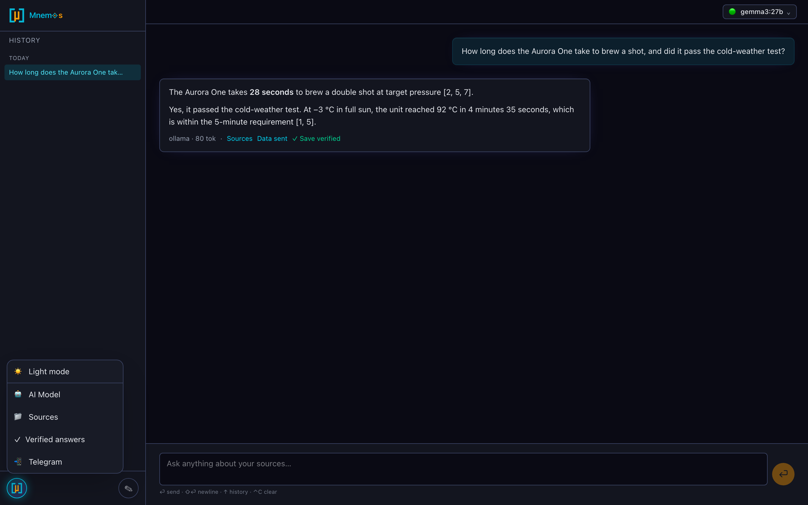
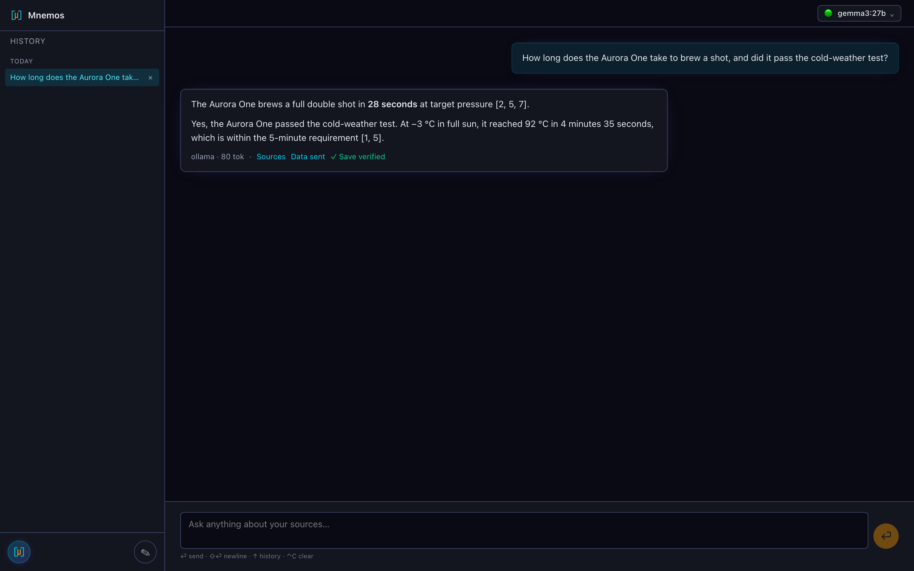
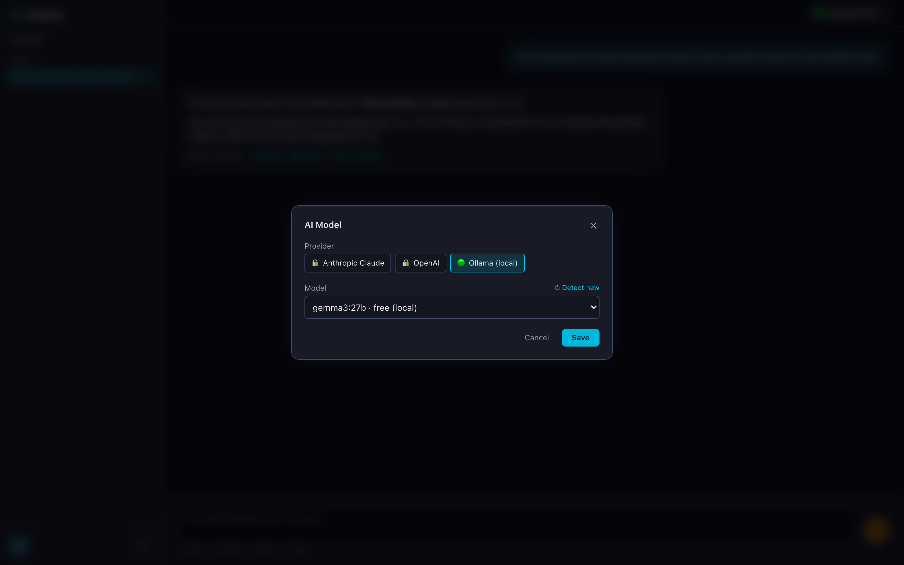
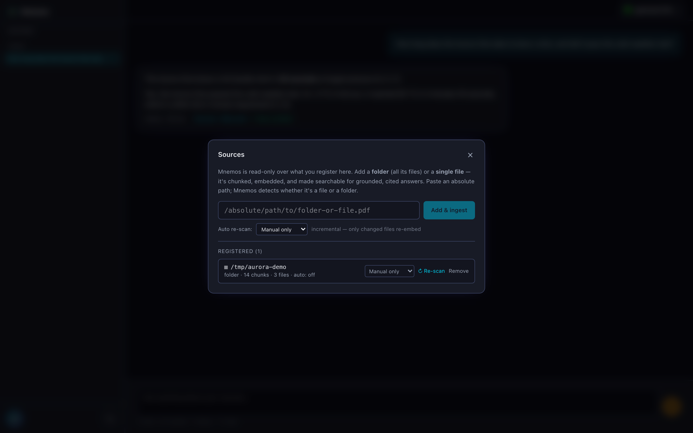
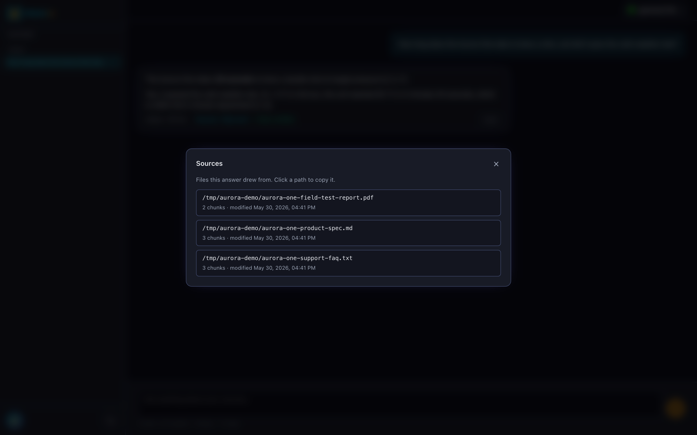
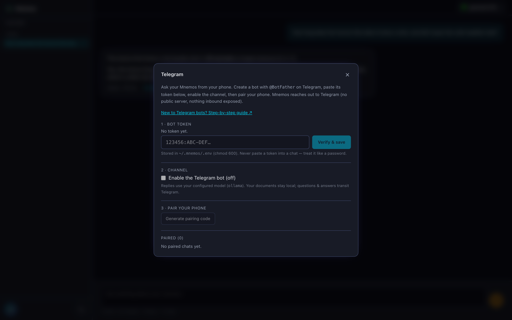

<div align="center">

# Mnemos

**Personal RAG. Local-first. Drop a folder, ask a question.**

[](LICENSE)
[](https://nodejs.org/)
[](CHANGELOG.md)
[](CONTRIBUTING.md)

</div>

Mnemos is a personal RAG (retrieval-augmented generation) system that defaults to **100% local** — embeddings on your machine, chat on your machine, zero external inference calls. Drop a folder of documents, ask questions in plain English, get answers with citations to your own files. The audit log captures every query for transparency; in the default install, **query audit events record the local chat provider (`ollama`)** and **ingest events stay local but don't carry a provider field** — no external-provider call is ever recorded.

If you choose to add a frontier LLM (Anthropic Claude or OpenAI today; Gemini planned), mnemos sends only the retrieved chunks — never raw files — and the audit log records the provider, model, retrieved chunk IDs, prompt-token estimate, and latency for each external request. Plugins are opt-in, not required. **Personal RAG means personal RAG. Privacy is the default.**

Built from scratch in TypeScript + Next.js. Opinionated single-pane UI — no drag-and-drop canvas, one strong default per pipeline stage, plug your own providers via a versioned SDK.

<p align="center">
  
  <br/>
  <em>One brain, two surfaces: ask on your desktop, or from your phone via a private Telegram bot — every answer cited to your own files. 100% local by default.</em>
</p>

## Quick start

The only prerequisite is **Node 22+** ([nodejs.org](https://nodejs.org/) if you don't have it).

```bash
git clone https://github.com/cosmicflow-space/mnemos.git
cd mnemos
node setup.mjs
```

That's it. The installer detects your OS (macOS, Linux, Windows), checks what's installed, asks before fixing anything, walks you through provider configuration, and starts the dev server. The install logic lives in [`INSTALL.md`](INSTALL.md) — readable as docs, executable by `setup.mjs`, no per-OS shell scripts to drift.

Then open <http://127.0.0.1:3030> — it's a single chat page. Everything lives behind the **settings launcher** (the glowing avatar, bottom-left):

1. **AI Model** — pick Claude, GPT, or Ollama (we auto-detect existing keys on disk). Local Ollama is the default and needs no key.
2. **Sources** — paste a folder *or single-file* path. Mnemos scans, classifies, and ingests with local BGE-small embeddings (no API key for ingest).
3. **Ask** — type a question; answers stream in with inline citations to the exact source chunks. (No sources yet? It still answers from the model's own knowledge, clearly labelled.)

End-to-end in under 90 seconds on a typical laptop. Then, optionally, pair **📲 Telegram** to ask from your phone.

<p align="center">
  
  <br/>
  <em>Everything lives behind the settings launcher: theme, AI model, sources, verified answers, and Telegram.</em>
</p>

Prefer Docker? `docker compose up -d`. Prefer manual? `pnpm install && pnpm dev`.

## What it looks like

<table>
  <tr>
    <td width="50%">
      
      <p align="center"><sub><strong>1. Ask</strong> — one chat pane, no chrome. Answers stream in with inline numbered citations, a metrics line (provider · model · tokens · duration), and inline actions to inspect <em>Sources</em>, see exactly what was sent to the model (<em>Data sent</em>), and mark an answer <em>✓ verified</em>. This answer fuses facts from a Markdown spec and a PDF report.</sub></p>
    </td>
    <td width="50%">
      
      <p align="center"><sub><strong>2. Pick your model</strong> — local Ollama models are <strong>ranked for your machine</strong> (fastest + most accurate first), with measured tok/s from your own queries and a ★ recommended default. It even suggests strong models you haven't installed (with <code>ollama pull</code>). Cloud providers stay locked until you add a key — and show <strong>dated pricing</strong> so a stale rate is obvious. Privacy is the default, not a setting.</sub></p>
    </td>
  </tr>
  <tr>
    <td width="50%">
      
      <p align="center"><sub><strong>3. Add a source</strong> — <strong>Browse</strong> to a folder/file (or paste a path; it's validated). Read-only. Mnemos shows an estimate, then indexes <strong>smallest-first</strong> so answers appear in seconds — and can <strong>defer large files to a background pass</strong>. Chunked + embedded locally (BGE-small), with per-source incremental re-scan.</sub></p>
    </td>
    <td width="50%">
      
      <p align="center"><sub><strong>4. Trace every claim</strong> — each answer's <em>Sources</em> opens the exact files it drew from, across formats (.md, .txt, .pdf), with chunk counts. Click a path to copy it. No black-box answers.</sub></p>
    </td>
  </tr>
</table>

## Ask from your phone (Telegram)

Your personal RAG runs on your computer — but you don't have to be *at* your computer to use it. Pair a private Telegram bot and ask questions from anywhere:

- **No public server, nothing exposed.** Mnemos *reaches out* to Telegram (long polling), so it works behind your home NAT with no port-forwarding, no tunnel, no public IP — the same outbound-only posture as everything else.
- **Private by default.** The bot answers **only you**. You pair your phone once with a single-use code from the UI; any other chat is ignored. Direct messages only — never groups.
- **Your documents stay home.** Only the question and answer pass through Telegram (and whichever model you've configured). Files never leave the machine.
- **Uses your configured model.** Local Ollama by default, or Claude/GPT if you've set one (Gemini planned) — the bot mirrors your choice.

Set it up in **Settings → 📲 Telegram** (there's a built-in [step-by-step guide](apps/web/app/telegram-guide/page.tsx) for anyone new to Telegram bots). The catch, by design: your computer must be awake with Mnemos running for the bot to reply.

<p align="center">
  
  <br/>
  <em>Paste a bot token, enable the channel, pair your phone with a single-use code — token stored chmod-600, never echoed back.</em>
</p>

> WhatsApp is on the radar but not yet supported — there's no free, local-first-friendly bot API for it the way Telegram offers.

## Smart model routing — switch models with one character

Mnemos's standout feature: **a single leading character on your message decides how it's answered** — whether to search your files, and which model (local or frontier) responds. No menus, no settings detour, no opening the web UI. The exact same syntax works in the web chat *and* the Telegram bot, so you can jump from "free local model" to "Claude flagship" **mid-conversation, from your phone**.

|                            | 🧠 Local (private, free) | ☁️ Frontier cheap | ☁️ Frontier flagship |
|----------------------------|--------------------------|-------------------|----------------------|
| **Search my files (RAG)**  | *(no prefix)*            | `+`               | `++`                 |
| **Skip my files (direct)** | `!`                      | `!!`              | `!!!`                |

Two independent choices, one keystroke each:

- **`!` = talk to the model directly.** Skips retrieval entirely — for meta questions (*"which model am I using?"*) or general knowledge that isn't in your files. No citations, nothing retrieved, nothing about your documents sent anywhere.
- **`+` = bring a frontier brain to your files.** Full RAG (your documents, cited) but answered by Claude/GPT instead of the local model — for a hard question over your own docs that deserves a stronger model.
- **Doubling escalates the model.** `!`→local, `!!`→cheapest configured frontier, `!!!`→top frontier; likewise `+`→cheap frontier RAG, `++`→flagship frontier RAG.
- **No prefix = the default:** your files, answered by your local model — fully private and free.

**From your phone, in plain text** (the `!`/`+` characters are inert in Telegram — no command/hashtag clashes):

```
!who won the 2024 World Series?              → local model, no file search
!!summarize the latest breakthroughs in AI   → Claude (cheap), no file search
+what's my deductible in my insurance policy → your files, answered by Claude
++weigh the tradeoffs in my design doc        → your files, answered by the flagship model
```

**Direct vs RAG, explicitly:** a *direct* (`!`) query answers from the model's own knowledge — fast, but frozen at the model's training cutoff and blind to your files. A *RAG* query (no prefix, or `+`) retrieves from your indexed documents and cites them. Use `!!`/`+` to reach a frontier model with a more recent knowledge cutoff for current-events or reasoning-heavy questions.

**Dynamic, safe, and visible:**
- Frontier tiers auto-pick the **cheapest** (or **most capable**, for the doubled sigils) *configured* frontier model. No API key set? Mnemos tells you and points you to add one — it never silently fails.
- Every answer is **labeled** ("⚡ Direct · files not searched", "☁️ Frontier") and the **audit log records** the provider, model, and whether retrieval ran — so each query's privacy posture is provable, and the labels persist across reloads.
- **`/tips`** shows the cheatsheet anytime; **`/cost`** shows your frontier spend to date (see [Usage & cost visibility](#usage--cost-visibility)). Both work on web and Telegram.

## Usage & cost visibility

Because routing can send some queries to paid frontier models, Mnemos keeps the bill in plain sight. Send **`/cost`** (web or Telegram) for an estimated breakdown of frontier spend — computed from provider-reported token counts × per-model pricing (with the pricing date shown, since rates change):

- **Total to date** and **cost by model**
- **Queries** split into frontier vs local, and **total tokens**
- **Number of sessions**, the **most expensive session**, and the **longest session**

Local (Ollama) queries are always free and counted separately, so `/cost` answers "what have my frontier prefixes actually cost me?" at a glance. Everything is computed on-device from your own history — no telemetry leaves the machine.

## How private do you want it? Three tiers

**Personal RAG means personal RAG. Privacy is the key — and the default.** Mnemos gives you three privacy tiers, in order of increasing data egress. *You choose.* Most users stay in Tier 1.

### Tier 1 — Fully local (default)
- **Embeddings**: BGE-small via ONNX, on your machine (first use downloads ~120 MB of model weights from Hugging Face once; cached thereafter — see [Offline note](#offline-note) below)
- **Chat**: Ollama on your machine (bundled `llama.cpp` is planned)
- **Network (after first-run model fetch)**: zero external inference calls. No chunks of your data leave the machine.
- **Auth**: none — no API keys, no OAuth
- **Best for**: sensitive data, offline use, full sovereignty

The default install IS this tier. `node setup.mjs` defaults to Ollama (the recommended option, no API key); the `/api/query` route defaults to `providerId: "ollama"` if callers omit it.

<a id="offline-note"></a>**Offline note**: BGE-small (the bundled embedding model) is fetched from Hugging Face on first ingestion, then cached locally. After that one-time fetch the install is fully offline-capable for ingest+local-chat. A future release may explore vendoring the model with the install for true zero-network first-run.

### Tier 2 — Hybrid (opt-in, per-question or per-session)
- **Embeddings**: local default (or external if you switch)
- **Chat**: Claude or GPT — you pick, you provide auth (Gemini planned)
- **Network**: only retrieved chunks (~500–2k tokens) cross the boundary. Never raw files. Never your full corpus.
- **Audit**: provider, model, retrieved chunk IDs, prompt-size estimate, latency, and provider-reported token counts. Capturing the exact request payload is a future goal.
- **Best for**: frontier-model quality, when you've consciously chosen to share retrieved chunks

The chat UI lets you switch the model per question.

### Tier 3 — Fine-tuned local (v0.3 sketch)
Train a small open model on your own corpus. Stays on your machine. Becomes specifically yours over time. Roadmap consideration — community input welcome.

### Vendor authentication — what mnemos accepts

**API key is the safe, sanctioned method for every external provider.** Mnemos's credential-detection feature scans for first-party CLI OAuth files (`~/.claude/.credentials.json` for Claude Code, `~/.codex/auth.json` for the OpenAI codex CLI), surfaces them in the UI as detected, but marks them **non-importable** with a TOS-explanation note. Reusing those tokens in third-party software is either prohibited (Anthropic) or undocumented (OpenAI).

| Vendor | Sanctioned method | Notes |
|---|---|---|
| **Anthropic Claude** | API key only | Anthropic [explicitly prohibits](https://code.claude.com/docs/en/legal-and-compliance) third-party reuse of OAuth tokens from Claude apps. Mnemos detects `~/.claude/.credentials.json` but refuses to import it. |
| **OpenAI / Codex** | API key only | The first-party `codex` CLI supports OAuth, but OpenAI does not document third-party reuse. Mnemos detects `~/.codex/auth.json` but refuses to import it. |
| **Google Gemini** | API key only (planned) | Gemini support is planned — the provider is scaffolded but not yet wired; when it lands, Mnemos will accept a Gemini API key. Google's platform also supports OAuth (via user-created OAuth client + `gcloud auth application-default login --client-id-file=client_secret.json`) and ADC via Vertex AI — both tracked but not yet wired. |
| **Ollama** | No auth needed | Local daemon, fully sovereign. |
| **llama.cpp** (planned) | No auth needed | Bundled, no daemon, no network. |

## What Mnemos is

- **Local-first**: SQLite + sqlite-vec, single file at `~/.mnemos/mnemos.db`. No separate vector database.
- **Private by default**: Bundled local embeddings (BGE-small ONNX) + local chat (Ollama) means RAG runs without any external inference service. Zero API keys, zero external inference calls, zero data egress after the BGE-small weights are cached on first ingestion ([Offline note](#offline-note) above). External LLM plugins are opt-in if you want frontier-model quality.
- **Single user**: One person, one machine. Loopback bind by default; LAN binding requires explicit opt-in and bearer-token auth.
- **Pluggable providers** (wired today): Anthropic, OpenAI, Ollama for chat. Local BGE-small + OpenAI + Ollama for embeddings. Add your own via the plugin SDK. Gemini and bundled `llama.cpp` providers are scaffolded stubs — planned, not yet wired.
- **Read-only**: Mnemos never modifies your files. Source access is opt-in per folder.
- **Auditable**: Every `query` event is recorded with chat-provider, model, retrieved chunk IDs, prompt-size estimate, latency, and provider-reported token counts. Every `ingest` event is recorded without a `provider` field (ingest is currently locked to the local embedder). In Tier 1 (local default), `query` events show `provider: "ollama"` (or another local provider) — no external-provider call is ever recorded. Visible in the UI. (Future goals: capture exact request payloads for external calls; add an explicit `external: boolean` flag.)
- **Safe defaults**: Auto-excludes credentials (`.env`, `*.pem`, `id_rsa*`) and noise (logs, lockfiles, minified bundles). Security excludes are hard-locked even against explicit user opt-in.
- **Citations**: Every answer references the source files, last-modified date, file type, and exact byte range.
- **Folders or single files**: Register a whole folder *or* one individual file. Mnemos auto-detects which — and the credential hard-lock holds either way (a file under `~/.aws/`, or a symlink to `~/.env`, is still refused).
- **Per-file metadata**: Each file carries a retrievable metadata chunk, so "how big is X" / "when was X modified" answer reliably even when no content chunk ranks high.
- **Incremental & self-updating**: Re-ingest skips unchanged files via content-hash comparison; partial-state ingests recover automatically via the `ingest_status` invariant. Sources can **auto re-scan** on a per-source schedule (manual by default — static archives cost zero background CPU; point a changing folder at a faster cadence from a dropdown). A concurrency-safe lease prevents a manual and a background scan from ever colliding.
- **Verified-answer memory**: Mark a correct answer as verified, and a closely-matching future question gets that confirmed answer injected into the prompt — so even a small local model nails facts it would otherwise fumble. Strict semantic matching, with lazy invalidation when the underlying files change. ([design notes](docs/design-notes/verified-answer-memory.md))
- **Ask from anywhere**: Pair a private Telegram bot and query your RAG from your phone — outbound-only, default-deny, your files never leave the machine (see [above](#ask-from-your-phone-telegram)).
- **Smart model routing**: a leading `!`/`+` on any message picks whether to search your files and which model (local or frontier) answers — switchable per message, from web or phone. See [Smart model routing](#smart-model-routing--switch-models-with-one-character).
- **Usage & cost visibility**: `/cost` reports estimated frontier spend (total, by model, priciest/longest session). See [Usage & cost visibility](#usage--cost-visibility).

## What Mnemos is not

- Not multi-tenant. Single user.
- Not a no-code visual builder. Opinionated pipeline.
- Not an agent platform. RAG only.
- Not a SaaS. Run it yourself.

## Status

Active development — **v0.16**. The core (local-first RAG, audit, atomic ingestion, cross-OS install) has been stable since v0.1; releases since then have added single-file sources, per-file metadata, automatic re-scan, verified-answer memory, the Telegram remote channel, Word/Excel/image-OCR ingestion, a server-powered folder picker, pausable/resumable ingestion, worker-thread embedding (no UI freeze during ingest), a model picker that ranks your local models by measured speed + accuracy, [smart prefix model routing](#smart-model-routing--switch-models-with-one-character), and `/cost` spend visibility. Track every release in [CHANGELOG.md](CHANGELOG.md).

## Architecture

The repo is a pnpm monorepo:

```
mnemos/
├── apps/web/              # Next.js 15 UI + API routes
├── packages/
│   ├── core/              # RAG pipeline (provider-agnostic)
│   ├── db/                # SQLite + sqlite-vec wrapper
│   ├── plugin-sdk/        # Plugin SDK barrel
│   └── cli/               # `mnemos` CLI
└── plugins/
    ├── embed-local/       # EmbeddingProvider (bundled, default — BGE-small via ONNX)
    ├── anthropic/         # ChatProvider (Claude)
    ├── openai/            # ChatProvider + EmbeddingProvider
    ├── gemini/            # ChatProvider (stub — planned)
    ├── ollama/            # ChatProvider + EmbeddingProvider (host-local)
    ├── llama-cpp/         # ChatProvider + EmbeddingProvider (stub — planned)
    ├── loader-pdf/        # DocumentLoader (PDF)
    ├── loader-docx/       # DocumentLoader (Word, via mammoth)
    ├── loader-xlsx/       # DocumentLoader (Excel, per-sheet to CSV-style text)
    ├── loader-ocr/        # DocumentLoader (image OCR via tesseract.js)
    ├── loader-markdown/   # DocumentLoader
    ├── loader-plaintext/  # DocumentLoader
    ├── loader-web/        # DocumentLoader for URLs
    └── loader-code/       # DocumentLoader for source code
```

Plugins can only import from `mnemos/plugin-sdk`. They cannot reach into `packages/core/**` or other plugins' internals. The SDK is versioned and backward-compatible.

## Trust model

Mnemos uses a **single-user trust model** — one person on one machine, not a multi-tenant service:

- **Default = zero external inference calls.** Local embeddings + Ollama for chat = no chunks of your data leave your machine. The audit log proves it by inspection: in Tier 1, `query` events record `provider: "ollama"` (or another local provider), and `ingest` events stay local without recording any provider field — no external-provider call is ever recorded. (One-time exception: BGE-small embedding weights are fetched from Hugging Face on first ingestion, then cached — see [Offline note](#offline-note).)
- The API is bound to 127.0.0.1 by default and trusts loopback callers (anyone reaching the loopback interface is already on the user's own machine). Binding to LAN (`MNEMOS_BIND=lan`) switches enforcement on and requires `Authorization: Bearer <token>` on every `/api/*` request, matching the auto-generated token at `~/.mnemos/auth.key`.
- Installed plugins are part of the trusted base (documented)
- Source access requires explicit registration (`mnemos source add <path>`)
- Frontier LLMs (Tier 2 only) see only retrieved chunks, never raw files
- The audit log captures provider, model, retrieved chunk IDs, prompt-size estimate, latency, and provider-reported token counts for every query — local and external. Capturing the exact request payload for external calls is a future goal.
- Audit data lives in the `audit_event` table inside `~/.mnemos/mnemos.db`. Inspect via `/api/audit` or by querying the SQLite table directly. There is **no** separate `audit.log` file.

## Your first 90 seconds

After `node setup.mjs` finishes, open **`http://127.0.0.1:3030`**. It's one page; the **settings launcher** (glowing avatar, bottom-left) opens everything as in-place panels — you never leave the chat.

1. **Settings → AI Model.** Mnemos auto-detects credentials in standard locations (shell rc files, provider auth files, gcloud ADC, the Ollama daemon on `:11434`). Click **Use this** on a detected key to import it (values stay on your machine — only locations are exchanged with the UI), or pick a provider and paste a key. Local Ollama needs none.

2. **Settings → Sources.** Paste a folder *or single-file* path (e.g. `~/Documents/notes` or `~/Documents/resume.pdf`). Mnemos detects which it is, then ingests with a live per-file progress indicator — entirely local via BGE-small, no API key. Security-blocked files (`.env`, `*.pem`, `id_rsa*`, anything under `~/.aws/` or `~/.ssh/`) are hard-locked and never indexed. Set a per-source auto re-scan cadence if the folder changes often (default is manual).

3. **Ask.** Type a question in the chat box. Answers stream in with citations to the exact source files; per-answer **Sources** and **Data sent** panels show precisely which files were used and which chunks (if any) left your machine. Mark a great answer **✓ verified** so it's nailed next time. Want to ask the model itself instead of your files — *"which model am I using?"*, or a general question? Start the message with `!` for **direct mode** (no retrieval, no citations). Or use a frontier model for the hard ones: `+` searches your files with a frontier brain, `!!` asks one directly — see **Smart prefix routing** below.

4. **Optional — pair Telegram** (Settings → 📲 Telegram) to ask all of the above from your phone.

That's it. End-to-end on a fresh laptop: usually under 90 seconds for the install + 30 seconds for the first ingestion of a small folder.

## Roadmap

**Shipped since v0.1** (every release is in [CHANGELOG.md](CHANGELOG.md)):
- **v0.5** — verified-answer memory
- **v0.6** — per-file metadata chunks
- **v0.7** — single-file sources + hardened credential guardrail
- **v0.8** — automatic per-source re-scan (concurrency-safe)
- **v0.9** — **Telegram remote channel** (ask your RAG from your phone), model selection persisted server-side
- **v0.10** — `MNEMOS_PORT` override (run a personal vault and a dev instance side by side), PDF-ingest-in-dev fix, public PII-free demo corpus
- **v0.11** — **pausable / resumable ingestion** with a live status ring, source-containment guard, filename-mention content retrieval, count/inventory answers from exact totals
- **v0.12** — **more formats: Word (.docx), Excel (.xlsx), and image OCR** (.png/.jpg/.tif/…); a **server-powered folder/file picker** for Add Source; quoted-path fix; credential hard-lock hardening (`.ssh/`/`.gnupg/` + realpath-canonicalized roots); brand refresh (bolder logo + two-tone neuron wordmark)
- **v0.13** — **worker-thread embedding** — the UI no longer freezes during a large ingest (12–20s hangs → ~25ms)
- **v0.14** — **a model picker that ranks for you** (local models ordered by speed × accuracy with measured tok/s from your own queries, a ★ recommendation, machine-aware guidance + `ollama pull` suggestions; frontier models show dated pricing) and **smart-auto ingestion** (pre-ingest estimate, smallest-first, defer-large-to-background)

**Foundations (v0.1–v0.4):** single-folder RAG, BYO API key, audit log, atomic ingestion, smart-default file exclusions, credential auto-detection, bearer-token auth (loopback bypass), cross-OS install via `setup.mjs`, in-chat onboarding, per-model cost tracking, rich Markdown output, light/dark theme.

**Directions we're exploring** *(ideas, not promises — community input very welcome):*
- **Even more file types** — audio/video (local speech-to-text), HEIC, scanned-PDF OCR (needs a PDF→raster step), and vision-model *description* of images (beyond today's text-OCR). Word, Excel, and image text-OCR already ship (v0.12). Recognized-but-not-yet-ingested types (HEIC, audio, video, email) are surfaced in the scan UI as politely deferred rather than silently ignored.
- **Better answers** — cross-encoder reranking of retrieved chunks; Gemini + bundled `llama.cpp` providers fully wired.
- **Easier installs** — npm global install, native macOS/Linux installers.
- **More places to ask from** — WhatsApp (pending a local-first-friendly API path), email ingestion.

These follow the project's north star: local-first, single-operator, RAG — not an agent platform. We'd rather ship a few things well than promise many.

## Contributing

See [CONTRIBUTING.md](CONTRIBUTING.md). First-time contributors will be asked to sign the [CLA](CLA.md) via the cla-assistant.io bot on their first PR — one click, then you're covered for all future PRs. AI-assisted contributions welcome; see [AGENTS.md](AGENTS.md) for collaboration patterns.

## Code of Conduct

All project-related interaction follows our [Code of Conduct](CODE_OF_CONDUCT.md).

## Security

Report vulnerabilities privately via [GitHub Security Advisory](https://github.com/cosmicflow-space/mnemos/security/advisories/new). See [SECURITY.md](SECURITY.md).

## License

MIT — see [LICENSE](LICENSE). Copyright © Zen Algorithms LLC

The CLA on contributions preserves the option to release additional terms (e.g. an Enterprise edition) in the future without re-permissioning prior contributors. The MIT-licensed code stays MIT-licensed.

## Credits

Mnemos is original work, written from scratch in TypeScript by **Sam Muthu** ([sammuthu.com](https://sammuthu.com)). Architectural choices were informed by surveying the broader RAG and personal-knowledge-base ecosystem.
